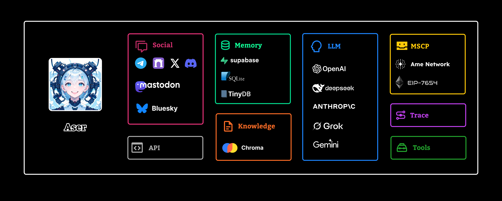

# Esper
> [!Warning]  
> Esper does not issue any tokens!


Esper is a lightweight, self-assembling AI agent. It focuses on building interactive applications that combine AI with social content.



## Installation 

**Install from pypi:**

```bash
pip3 install ame-esper
```

**Clone the repository:**

```bash
git clone https://github.com/AmeNetwork/esper.git
cd esper
pip3 install -r requirements.txt
```

## Set up environment variables
Please refer to `.env.example` file, and create a `.env` file with your own settings. You can use two methods to import environment variables.

**Using python-dotenv:**  
```bash
pip install python-dotenv
```
Then add the following code to your python file.

```python
from dotenv import load_dotenv
load_dotenv()
```

**Exporting all variables in the terminal:**  
```bash
export $(grep -v '^#' .env | xargs)
```

## Examples

Create a simple AI Agent:

```python
from esper.agent import Agent
agent=Agent(name="esper agent",model="gpt-3.5-turbo")
response=agent.chat("What is Bitcoin?")
```

Create Discord and Telegram AI Agent in 1 minute: 
```python
# Discord AI Agent
from esper.social.discord import DiscordClient
from esper.agent import Agent
agent=Agent(name="discord agent", description="discord agent",model="gpt-3.5-turbo")
discord_agent = DiscordClient(agent)
discord_agent.run()
```
  
```python
# Telegram AI Agent
from esper.social.telegram import TelegramClient
from esper.agent import Agent
agent=Agent(name="telegram agent", description="telegram agent",model="gpt-3.5-turbo")
telegram_agent=TelegramClient(agent)
telegram_agent.run()
```

Create an AI Agent with Memory:
```python
from esper.agent import Agent
from esper.memory import Memory
memory = Memory(type="sqlite")
agent = Agent(
    name="esper agent", model="gpt-3.5-turbo", memory=memory
)
response = agent.chat("What is Bitcoin?", uid=1)
```

Create an AI Agent with Knowledge:
```python
from esper.agent import Agent
from esper.knowledge import Knowledge

knowledge = Knowledge(name="CryptoHistory", query_ns=1)
knowledge_data = [
    {
        "id": "1",
        "document": "Ethereum is a decentralized blockchain with smart contract functionality.",
        "metadata": {"founder": "Vitalik Buterin", "token": "ETH", "year": 2013},
    },
    {
        "id": "2",
        "document": "Bitcoin is a decentralized digital currency.",
        "metadata": {"founder": "Satoshi Nakamoto", "token": "BTC", "year": 2009},
    },
    {
        "id": "3",
        "document": "Binance is a cryptocurrency exchange.",
        "metadata": {"founder": "CZ", "token": "BNB", "year": 2017},
    },
]
knowledge.upsert(knowledge_data)
agent = Agent(
    name="esper agent",
    description="esper agent",
    model="gpt-3.5-turbo",
    knowledge=knowledge,
)
response = agent.chat("what is Ethereum?")
```

Create an AI Agent with Tools:
```python
from esper.tools import Tools
from esper.agent import Agent
tools=Tools()
def get_btc_price():
    return "$10,0000"

tools.add(
    name="get_bitcoin_price",
    description="when user ask bitcoin price, return bitcoin price",
    parameters=None,
    function=get_btc_price,
)

agent=Agent(name="esper",model="gpt-3.5-turbo",tools=tools)

response=agent.chat("what is bitcoin price?")
```

Create an AI Agent with Trace:
```python
from esper.trace import Trace
from esper.agent import Agent
trace=Trace(session=1)
agent=Agent(name="esper agent",model="gpt-3.5-turbo",trace=trace)
response=agent.chat("what is bitcoin?")
```

Create an AI Agent with [Model Smart Contract Protocol](https://github.com/AmeNetwork/Model-Smart-Contract-Protocol):       
```python
from esper import Agent
from esper.mscp import Connector
from eth_account import Account
import os
from esper.mscp.chat2web3 import Chat2Web3

# Create a connector to connect to the component
component = Connector(
    "http://127.0.0.1:8545", # RPC of the component network
    "0x29a79095352a718B3D7Fe84E1F14E9F34A35598e"  # component address
)

# Get the methods of the contract
methods = component.get_methods()

#Import the private key from the environment variable
account = Account.from_key(os.getenv("EVM_PRIVATE_KEY"))

# Initialize Chat2Web3 object for handling blockchain interactions
chat2web3 = Chat2Web3(account)

# Add a method named "getUserInfoByAddress" to chat2web3
chat2web3.add(
    name="getUserInfoByAddress",
    prompt="When a user wants to get a user's name and age, it will return 2 values: one is the name, and the other is the age.",
    method=methods["getUser"],  # Use the getUser method from the contract
)

# Create an Agent instance
agent = Agent(
    name="chat2web3",  # Agent name
    model="gpt-4o",  # Specify the model to use
    chat2web3=chat2web3  # Use the previously created chat2web3 object
)

# Agent responds with final answer
response = agent.chat("What is the user's name and age?0xa0Ee7A142d267C1f36714E4a8F75612F20a79720")

print(response)
```

Create an AI Agent Server:
```python
from esper.api import API
from esper.agent import Agent
agent=Agent(name="api-agent",model="gpt-3.5-turbo")
api=API(agent)
api.run()
```

